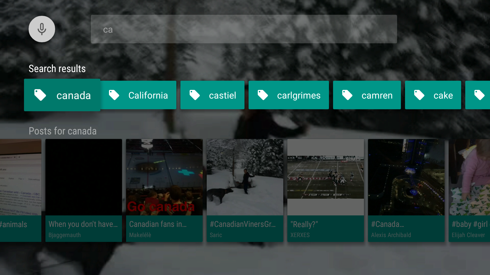
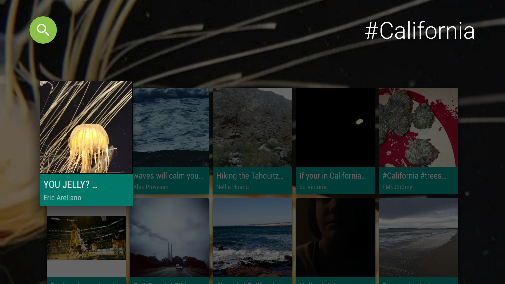

Vineyard [](https://travis-ci.org/hitherejoe/Vineyard)
========

Vineyard is an _unofficial_ Vine client for Android TV. The project currently consists of:

- Android TV Application
- Unit Tests
- User Interface Tests


Release 1.0 of the application allows you to:

- Browse feeds from a range of Video Categories
- Watch Vine video posts
- Search for Vine Users and Hashtags
- View video grids for Users and Hashtags
- Toggle the Auto-Loop option via Settings

##Custom Components

Many of the screens used some of these custom components created especially for the needs of this app:

[Video Card View](/app/src/main/java/com/hitherejoe/vineyard/ui/widget/VideoCardView.java)

This view extends the BaseCardView class so that we can make our own custom CardView. The functionality
of this view is display a video preview of the vine post card that is currently in focus. It's made up
of the following components:

- [Looping Video View](/app/src/main/java/com/hitherejoe/vineyard/ui/widget/LoopingVideoView.java) - This is a custom VideoView that automatically loops a video without sound.
- [Preview Card View](/app/src/main/java/com/hitherejoe/vineyard/ui/widget/PreviewCardView.java) - This is the layout class used by the video card view.

<p align="center">
    
</p>

[Pagination Adapter](/app/src/main/java/com/hitherejoe/vineyard/ui/adapter/PaginationAdapter.java)

Here I created a custom adapter by extending the standard ArrayObjectAdapter to allow the application
to handle pagination requests. When the final item in a row of Posts becomes focused, the paginated
request is triggered and the [Loading Card View](/app/src/main/java/com/hitherejoe/vineyard/ui/widget/LoadingCardView.java) is displayed
until the results are returned.

[Loading Card View](/app/src/main/java/com/hitherejoe/vineyard/ui/widget/LoadingCardView.java)

The Loading Card View again extends the BaseCardView class and is a simple cardview that displays
a loading indicator to the user. This is used when Pagination is in use (using the PaginationAdapter)
to notify the user that Posts are being loaded.

[image]

[Tag Card View](/app/src/main/java/com/hitherejoe/vineyard/ui/widget/TagCardView.java)

The Tag Card View again extends the BaseCardView class and is a simple cardview that displays either
a hashtag or username. This is used to display the search results in the SearchFragment.

[image]

[Icon Card View](/app/src/main/java/com/hitherejoe/vineyard/ui/widget/IconCardView.java)

The Icon Card View again extends the BaseCardView class and is an interactable cardview that can be used to
display an icon with both a title and description. Currently I use this for several different situations:

- Displaying options

[image]

- Displaying a 'Try Again' card when there is an error fetching results

[image]

- Displaying a 'Check Again' card when an empty result list is returned

[image]

#Screens

[Browse Fragment](/app/src/main/java/com/hitherejoe/vineyard/ui/fragment/MainFragment.java)

The browse fragment is what is used to display the browseable categories, post and options card.
These are all made up from several different components:

- [Icon Header Item Presenter](/app/src/main/java/com/hitherejoe/vineyard/ui/presenter/IconHeaderItemPresenter.java) - The presenter used to set and display the content of each category.
- [Icon Card View](/app/src/main/java/com/hitherejoe/vineyard/ui/presenter/IconItemPresenter.java) -
- [Icon Item Presenter](/app/src/main/java/com/hitherejoe/vineyard/ui/presenter/IconItemPresenter.java) -
- [Loading Presenter](/app/src/main/java/com/hitherejoe/vineyard/ui/presenter/LoadingPresenter.java) -

<p align="center">
    
</p>
<p align="center">
    
</p>


[Playback Activity](/app/src/main/java/com/hitherejoe/vineyard/ui/activity/PlaybackActivity.java)

The Playback Activity is used to play the video from a Vine post. This uses:

- [PlaybackOverlayFragment](/app/src/main/java/com/hitherejoe/vineyard/ui/fragment/PlaybackOverlayFragment.java) - Used to display the playback controls over the top of the PlaybackActivity.

<p align="center">
    
</p>

<p align="center">
    
</p>


[Search Fragment](/app/src/main/java/com/hitherejoe/vineyard/ui/fragment/SearchFragment.java)
<p align="center">
    
</p>

[Post Grid Fragment](/app/src/main/java/com/hitherejoe/vineyard/ui/fragment/PostGridFragment.java)
<p align="center">
    
</p>

[AutoLoop Step Fragment](/app/src/main/java/com/hitherejoe/vineyard/ui/fragment/AutoLoopStepFragment.java)
<p align="center">
    
</p>

##Building

To build, install and run a debug version, run this from the root of the project:

````./gradlew assembleDebug```

##Unit Tests

To run the unit tests for the application:

````./gradlew testDebugUnitTest```

##User Interface Tests

To run the user interface tests for the application:

````./gradlew connectedDebugAndroidTest```