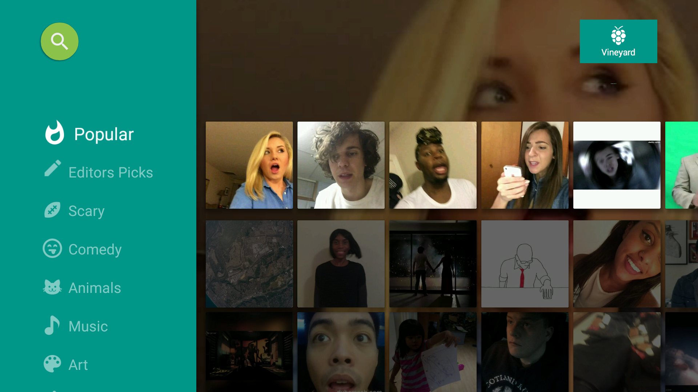
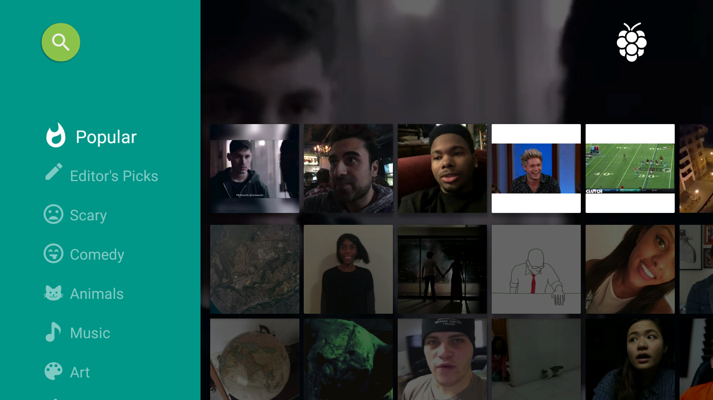
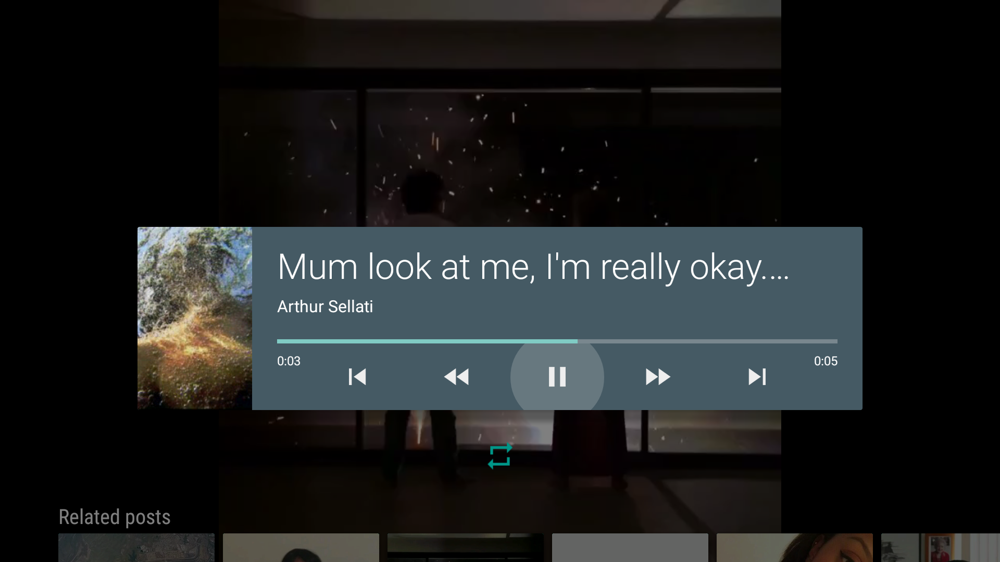
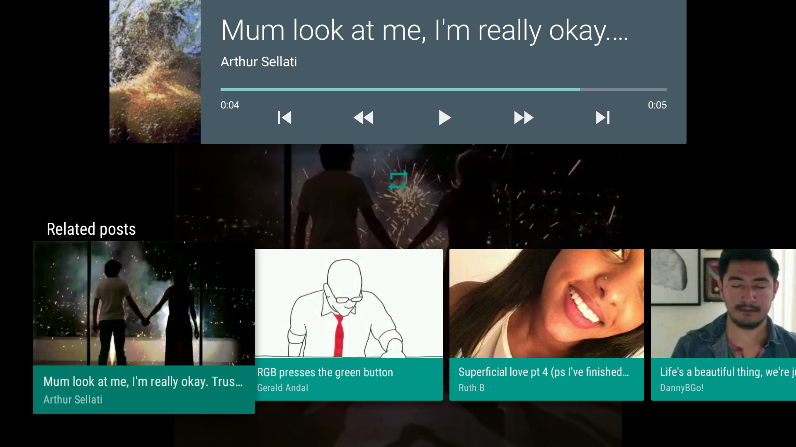
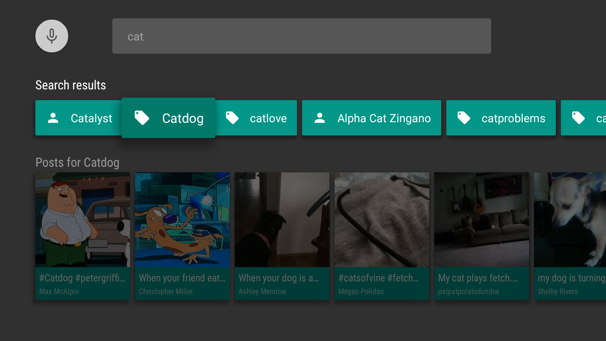
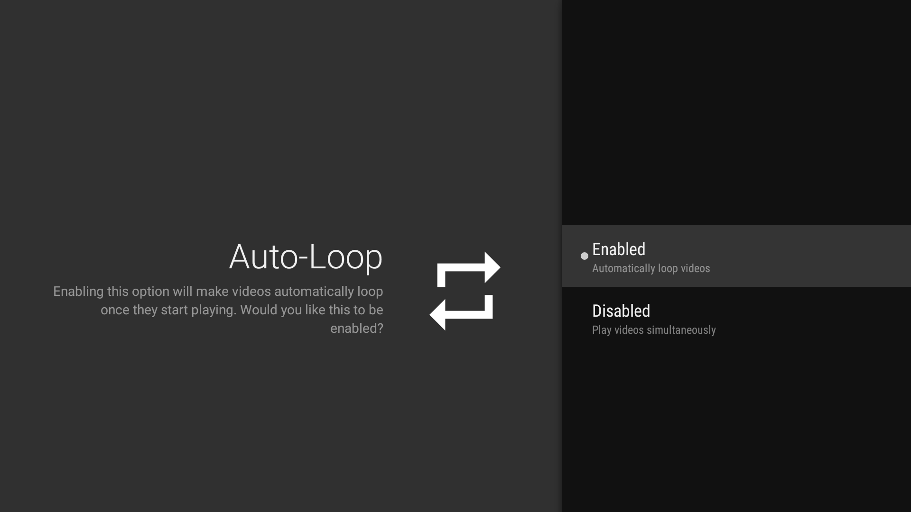

Vineyard [](https://travis-ci.org/hitherejoe/Vineyard)
========

Vineyard is an _unofficial_ Vine client for Android TV. The project currently consists of:

- Android TV Application
- Unit Tests
- User Interface Tests


Release 1.0 of the application allows you to:

- Browse feeds from a range of Video Categories
- Watch Vine video posts
- Search for Vine Users and Hashtags
- View video feeds for Users and Hashtags
- Toggle the Auto-Loop option via Settings

This functionality is split across the following screens:

[Main Fragment](/app/src/main/java/com/hitherejoe/vineyard/ui/fragment/MainFragment.java)
<p align="center">
    
</p>


[Browse Fragment](/app/src/main/java/com/hitherejoe/vineyard/ui/fragment/MainFragment.java)
<p align="center">
    
</p>


[Playback Activity](/app/src/main/java/com/hitherejoe/vineyard/ui/activity/PlaybackActivity.java)
<p align="center">
    
</p>


[Playback Activity](/app/src/main/java/com/hitherejoe/vineyard/ui/activity/PlaybackActivity.java)
<p align="center">
    
</p>


[Search Fragment](/app/src/main/java/com/hitherejoe/vineyard/ui/fragment/SearchFragment.java)
<p align="center">
    
</p>

[AutoLoop Step Fragment](/app/src/main/java/com/hitherejoe/vineyard/ui/fragment/AutoLoopStepFragment.java)
<p align="center">
    
</p>

##Building

To build, install and run a debug version, run this from the root of the project:

````./gradlew assembleDebug```

##Unit Tests

To run the unit tests for the application:

````./gradlew testDebugUnitTest```

##User Interface Tests

To run the user interface tests for the application:

````./gradlew connectedDebugAndroidTest```